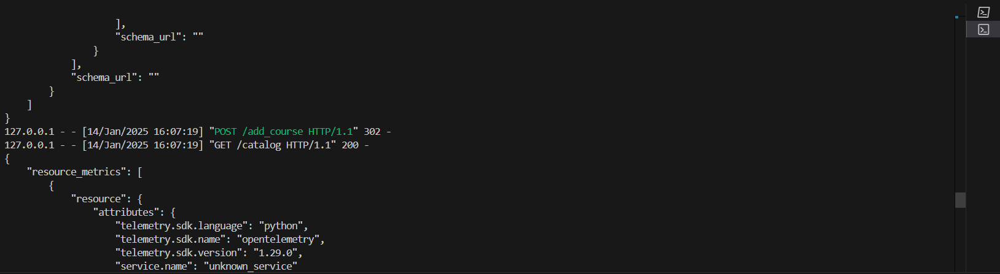
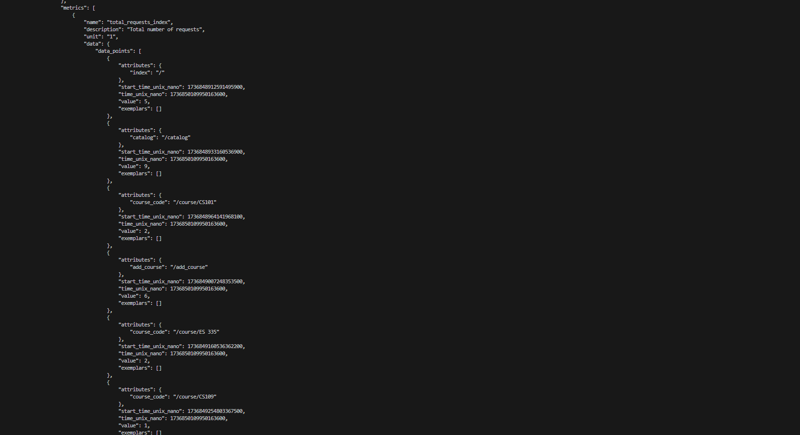

## CS 203 Lab Assignment 1

#### Data Collection using OpenTelemetry and Jaeger

---

**_Team Members_**
Name | Roll Number
---|---
Soham Gaonkar| 23110314
Chaitanya Sharma | 23110072

---

#### Features 

---

### 1. Logging and Tracing of Page Visits

- **Screenshot 1 , 2:** Homepage and Course Catalog page.  
  
   

- **Screenshot 3:** .Tarce Collected on Jaeger of homepage and course catalog visit.  
  

- **Screenshot 4:**  Viewing Course Details.  
  

- **Screenshot 5:**  Trace Collected on Jaeger of course page visit.  
  

### 2. Adding Courses 

- **Screenshot 6:** Incomplete Form Submission.  
  

- **Screenshot 7 , 8 , 9:** Confirmation message after successfully adding a course. 
   
    
  

- **Screenshot 10:** Log of successful course addition.  
  

---

### 2. Invalid Page Requests and Error Handling

- **Screenshot 10:** Invalid Course ID.  
  

- **Screenshot 11:** Tracing data for invalid course request.  
  
  

- **Screenshot 12:** Invalid Page Handling. 
  
  

- **Screenshot 13:** Structurred Logs saved in JSON format.  
  
-
---

### 3. Metrics Data

- **Screenshot 14:** Total number of requests made to each endpoint.  
  

- **Screenshot 15:** Processing time for each endpoint.  
  

- **Screenshot 16:** Error Count for each endpoint.  
  

---

Dependencies:
- `flask`, `opentelemetry-instrumentation`, `opentelemetry-instrumentation-flask`, `opentelemetry-exporter-jaeger`

To run the project:
- Run `python app.py` in the terminal.

---